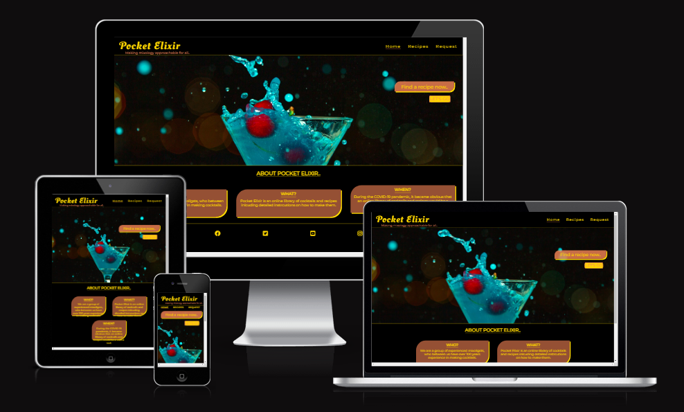
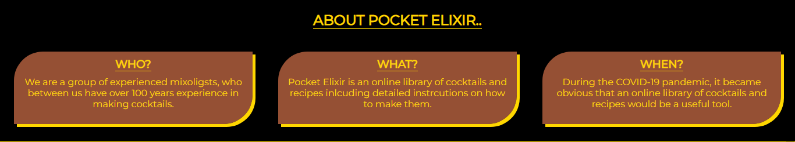
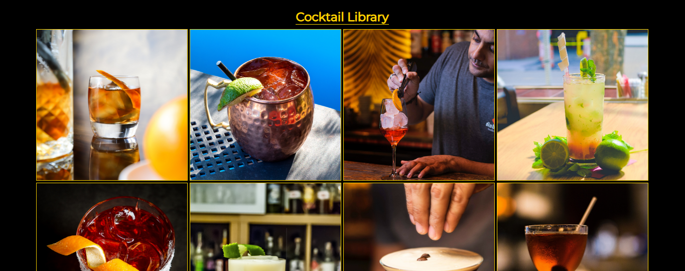
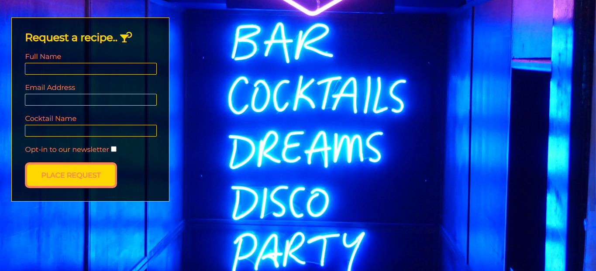
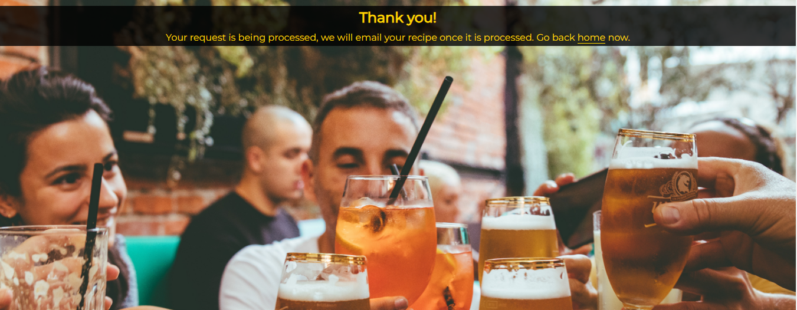
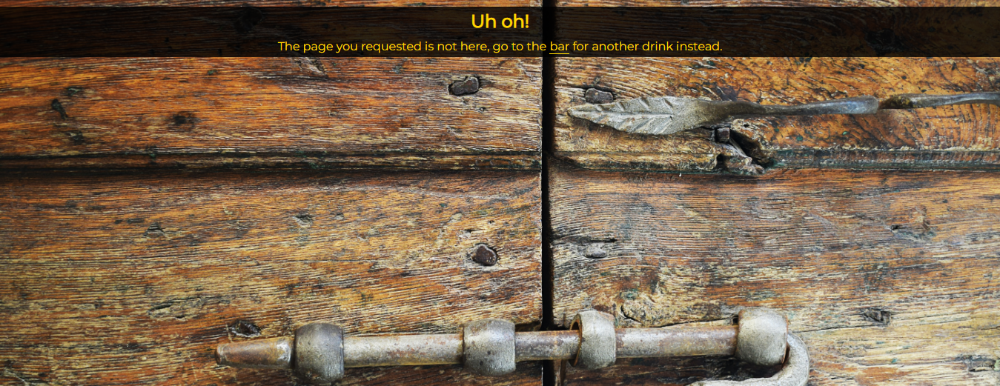

# Pocket Elixir

Pocket Elixir is a site aimed at providing an online presence for the start-up Pocket Elixir. Pocket Elixir is a company dedicated to making mixology aproachable for all. The site will be targeted towards mixology professionals and aspiring home mixologists alike, allowing its users to find information about cocktails. This information will consist of ingredients and preparation methods, and will be presented using text and images.

The site will also allow users to request cocktails not currently included in the library by filling out a request form.

In the future it is planned that the site will provide the user with the ability to book a professional mixologist for their own private functions. For now this idea has been confirmed as being out of the scope of the current project.

## Features 

### Existing Features

- __Navigation Bar__

  - The navigation bar is styled in a consistant fashion across all three pages of the site. It includes a logo (which doubles as a link to the home page), and links to index.html, recipes.html and request.html
  - Also present on 404.html and thanks.html but not containing links to these pages. It allows the user to navigate away from these pages, eliminating the need to use the browser's back button.
  - Given the styling and familiar look and feel of the navigaton bar, it will allow for uses to easily navigate the site. 

- __The landing page image__

  - The landing page includes a photograph with text overlay and a call to action grab the user's attention and allow them direct access information (reason for visit).
  - This section introduces the user to Pocket Elixir with an emotion invoking image of the users end product, leaving no doubt as to what the site is about.

- __About Us__

  - The about us section, located on the landing/home page provides a brief explanation to the user as to who and what Pocket Elixir is and when it was created.

- __The Footer__ 

  - The footer is styled in a similar consistant fashion as the navigation bar across all pages provides links to relevant social media sites for Pocket Elixir. These links when clicked will open a new broswer tab, providing easy naviagation for the user and preventing interurpted visits.
  - The footer is also present on 404.html and thanks.html again to alow the user an easier option to navigate away from these pages and to encourage visits to social media channels.

- __Recipes__

  - The reciepes page is the main focus of the entire site. Here the user is presented with images of all cocktails included in our library. When the user hovers over the image (or taps the image on a touchscreen device), the image flips 180 degrees horizontally providing the user with further information about the particular cocktail. 
  - On this page valuable information such, as what the cocktail consists of, how is it made, what it should look like is provided to the user. Further information on each cocktail is availble to the user in the form of a clickable link (embedded in the cocktails name) to each cocktails wikipedia page. These links follow the forat of the footer link by opening in a new browser tab.

- __Request Page__

  - On the request page, the user is provided with a form allowing them to request a cocktail they cannot find in the current library. The user is required to submit their full name, email address and name of requested cocktail. The user is also provided with an option to join the Pocket Elixir mailing list. 

- __Thank You Page__

  - Upon submission of the completed form, the user is redirected to this page (thanks.html). This page confirms successful completion of the request to the user.

- __404 Page__

  - If the user navigates to a page that doesn't exist, they are redirected here. Informing the user that they have not reached their requested page.

### Features Left to Implement

- Book A Mixologist (out of scope). In the future it is planned to implement a book your own mixologist feature. This would allow user to book a mixologist for their own private functions. Mixologists could be rated by past users and categorised by location, skill level and rating.
- Search functionality (out of scope). As the cocktail library grows, it would be beneficial to the user to provide them the ability to search through it rather than have to scroll to find what they are looking for. Further categorisation could also be beneficial. Allowing users to categorise cocktails by using filters such as Base Spirit or Production Method i.e. Shaken or Stirred.

## Testing

- Responsiveness
The site displays as intented on screens 420px and smaller and also on screens 1284px and larger.
When testing responsiveness between these screen sizes it was observed that the about section on the home page form section on the request page were not fully responsive and became distorted, allowing content to spill out. The recipes page was tested and found to be fully responsive with the amount of flip cards being horizontally displayed reducing while remaining centered as the screen width decreased.

- Features 
The flip card animation is working as intended.
The recipes page was tested and found to be fully responsive with the amount of flip cards being horizontally displayed reducing while remaining centered as the screen width decreased.
All links are functioning as intended with internal links keeping the user on the site and all external links opening in a new browser tab, preventing the user being bounced to another site.
The form cannot be submitted unless all required input fields are populated correctly.
The form cannot be submitted unless the email input field is populated with the correct email address format.
The form can be successfully submitted with or without the "opt in to mailing list" checkbox being checked. 
Once the form is submitted correctly the user is redirected to thanks.html
If the user navigates to a page that doesn't exist, they are successfully redirected to 404.html

### Validator Testing 

- HTML
  - No errors were returned when passing through the official [W3C validator](https://validator.w3.org/nu/?doc=https%3A%2F%2Fdgdcosgrove.github.io%2Fpp1_pocket_elixir%2F)
- CSS
  - No errors were found when passing through the official [(Jigsaw) validator](https://jigsaw.w3.org/css-validator/validator?uri=https%3A%2F%2Fdgdcosgrove.github.io%2Fpp1_pocket_elixir%2F&profile=css3svg&usermedium=all&warning=1&vextwarning=&lang=en)

### Unfixed Bugs

Page loading times are affected due to the size of images used.
Site is not fully responsive.
On mobile view, the text at the bottom of the recipes page occupies too much of the screen width making it difficult to read.

You will need to mention unfixed bugs and why they were not fixed. This section should include shortcomings of the frameworks or technologies used. Although time can be a big variable to consider, paucity of time and difficulty understanding implementation is not a valid reason to leave bugs unfixed. 

## Deployment 

- The site was deployed to GitHub pages. The steps to deploy are as follows: 
  - In the GitHub repository, navigate to the Settings tab 
  - From here, click on Pages link in left sidebar.
  - From the source section drop-down menu, select the Main Branch
  - Once the main branch has been selected, click save and the page will be automatically refreshed with a detailed ribbon display to indicate the successful deployment. 

The live link can be found here - https://dgdcosgrove.github.io/pp1_pocket_elixir/ 

## Credits 

### Content 

- The text for all pages was written by Daniel Cosgrove
- The html and css to create and style the flip cards was adapted from [W3C](https://www.w3schools.com/howto/howto_css_flip_card.asp)
- The html and css to create and style the footer was adapted from the Love Running Walkthrough Project
- The icons used in the footer and request form were taken from [Font Awesome](https://fontawesome.com/)

### Media

- All images used on this project were sourced from https://unsplash.com
